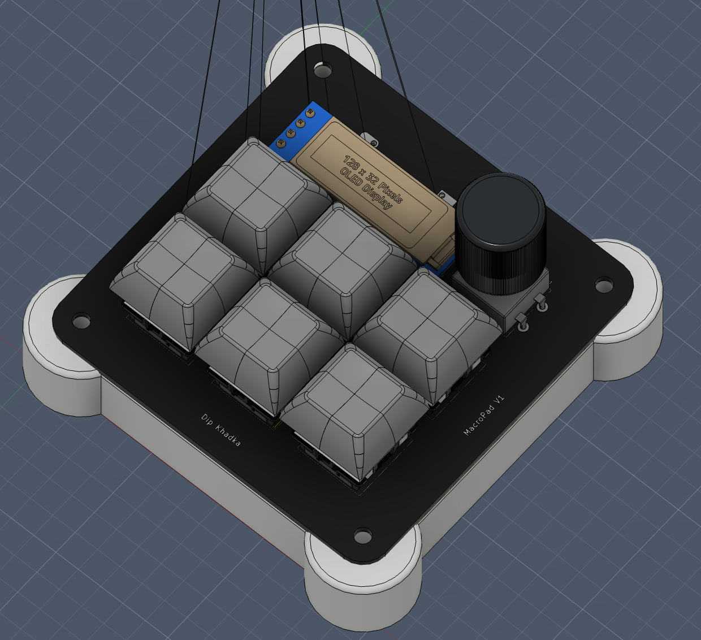
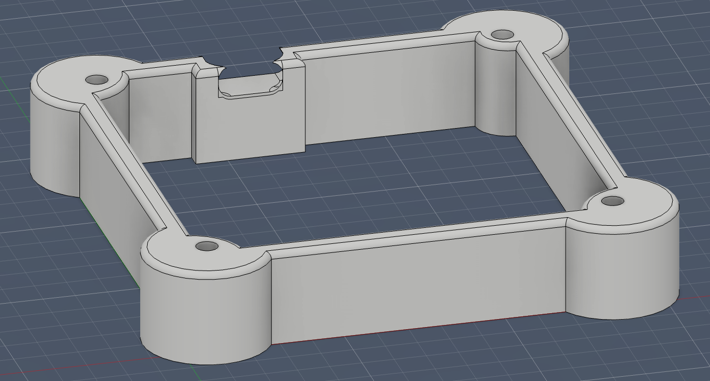
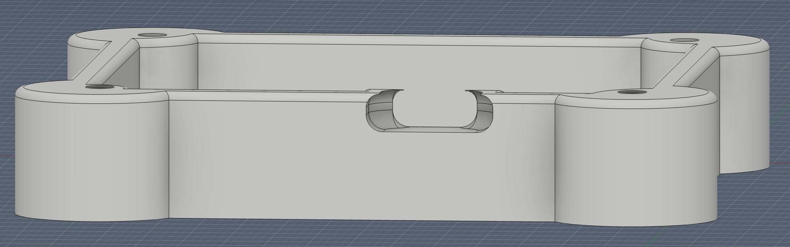
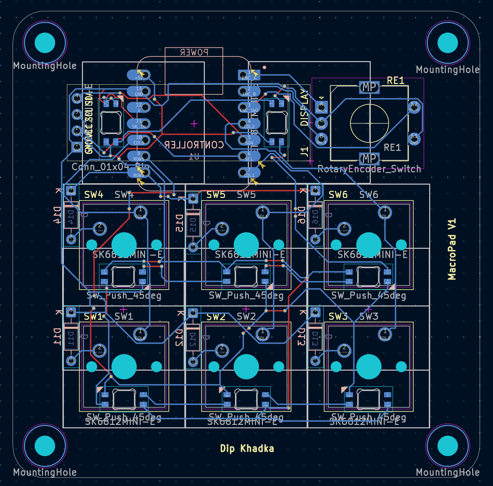
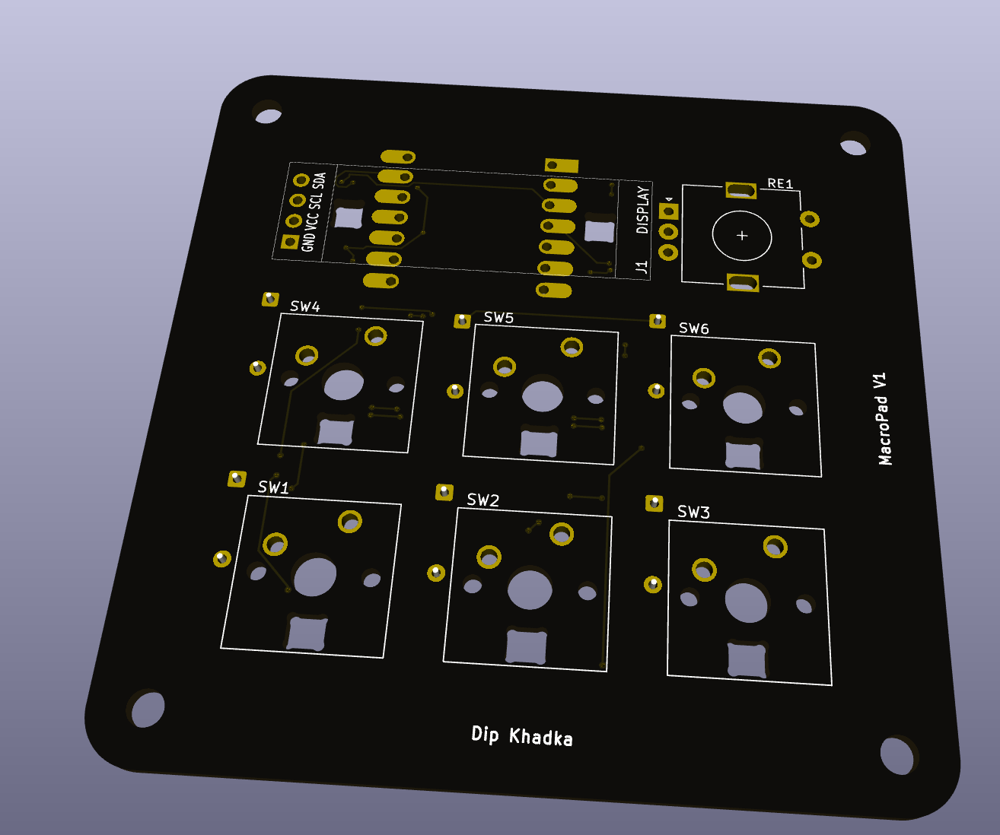
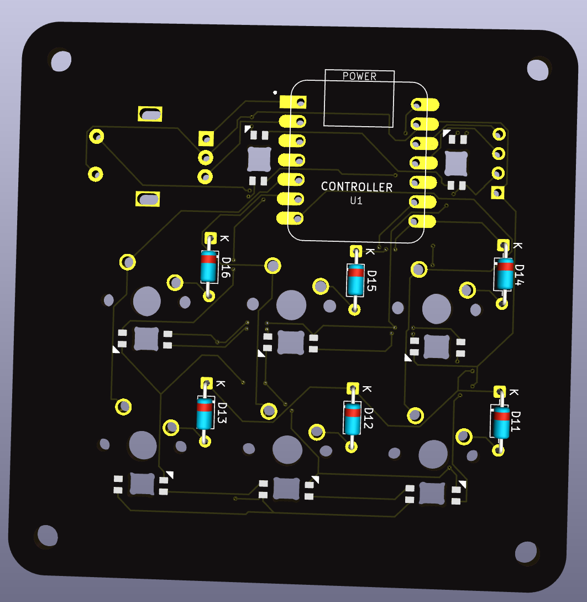
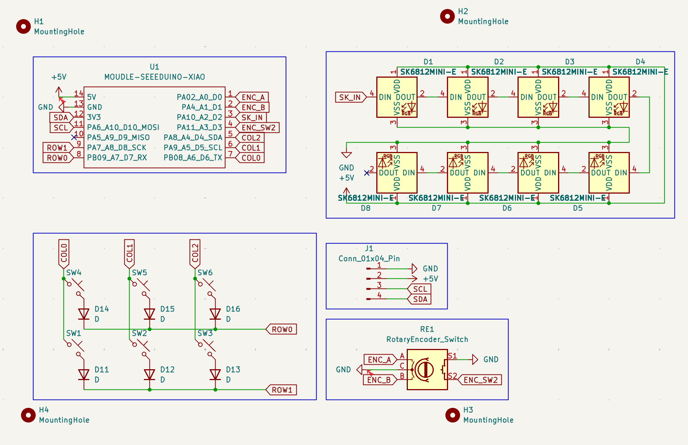

# MacropadV1

MacropadV1 is a custom-designed 6-key mechanical macropad featuring a rotary encoder, an OLED display, and RGB lighting. It's powered by the Seeed Xiao RP2040 and running KMK firmware

## ✨ Features

- **6 Mechanical Switches**: MX-style switches.
- **Rotary Encoder**: Smooth scrolling and volume control.
- **OLED Display (128x32)**: Real-time feedback on layers, status, and custom animations.
- **7 Addressable RGB LEDs**: Fully customizable underglow and per-key lighting.
- **Compact Design**: Custom-designed 3D printable case for minimalistic vibe.
- **KMK Firmware**: Easily customizable using Python.

## � Bill of Materials (BOM)

| Component | Quantity | Specification |
| :--- | :---: | :--- |
| **Microcontroller** | 1 | Seeed Xiao RP2040 |
| **Switches** | 6 | MX-style Mechanical Switches |
| **Keycaps** | 6 | MX-compatible Keycaps |
| **Rotary Encoder** | 1 | EC11 Encoder with Push Button |
| **OLED Display** | 1 | 0.91" 128x32 I2C OLED |
| **Diodes** | 6 | 1N4148 Through-hole Diodes |
| **RGB LEDs** | 7 | SK6812 Mini-E |
| **PCB** | 1 | Custom MacropadV1 PCB |
| **Hardware** | 4 | M3 x 16mm Screws |
| **Case** | 1 | 3D Printed Case |

### Case Design
The project includes a custom 3D printable case designed for a sleek, low-profile look.

| Case Angled View | Case Back View |
| :---: | :---: |
|  |  |

## 🖥 Firmware

MacropadV1 runs on **KMK Firmware**, a feature-rich keyboard firmware written in CircuitPython.

### Keymap Configuration
The default keymap includes dedicated layers for media control, macros (Copy/Paste/Save), and RGB lighting effects.

- **Layer 0**: Media controls, Copy/Paste/Cut macros, Screen Snipping.
- **Layer 1**: Navigation and Select All macros.
- **Layer 2**: RGB Lighting controls (Mode, Brightness, Color).

The rotary encoder is mapped to volume control by default.

## 🎨 PCB & Electronics

The PCB has been designed in KiCad.

### PCB Layout

### 3D Visualizations
| Front | Back |
| :---: | :---: |
|  |  |

### Schematic

## 📂 Project Structure

- `firmware/`: KMK configuration (`main.py`)
- `pcb/`: KiCad project files
- `cad/`: 3D design files for the case (STLs/Step)
- `media/`: Project images and documentation assets

---
Designed by **Dip Khadka**
